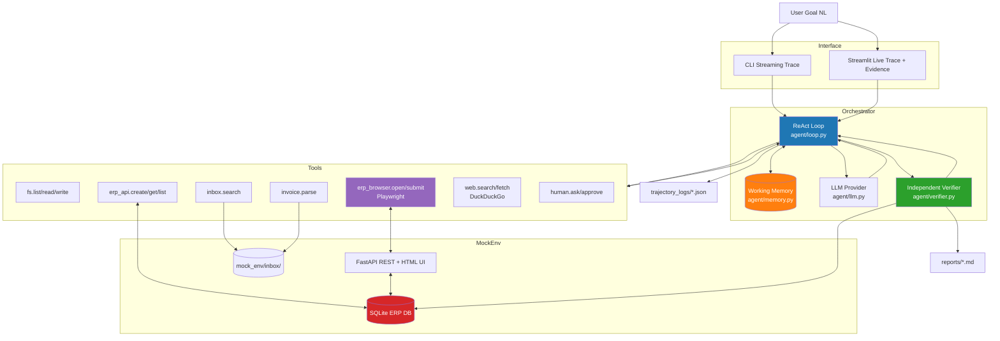

```mermaid
flowchart TD
    subgraph Interface
        CLI[CLI Streaming Trace]
        UI[Streamlit Live Trace + Evidence]
    end

    subgraph Orchestrator
        Loop[ReAct Loop\nagent/loop.py]
        Memory[(Working Memory\nagent/memory.py)]
        LLM[LLM Provider\nagent/llm.py]
        Verifier[Independent Verifier\nagent/verifier.py]
    end

    subgraph Tools
        FS[fs.list/read/write]
        Inbox[inbox.search]
        Parse[invoice.parse]
        ERPAPI[erp_api.create/get/list]
        Browser[erp_browser.open/submit\nPlaywright]
        Web[web.search/fetch\nDuckDuckGo]
        Human[human.ask/approve]
    end

    subgraph MockEnv
        ERP[(SQLite ERP DB)]
        ERPServer[FastAPI REST + HTML UI]
        InboxDir[(mock_env/inbox/)]
    end

    User[User Goal NL] --> CLI & UI
    CLI & UI --> Loop
    Loop <--> Memory
    Loop --> LLM
    LLM --> Loop
    Loop --> Tools
    Tools --> Loop
    ERPAPI <--> ERP
    Browser <--> ERPServer
    ERPServer <--> ERP
    Inbox --> InboxDir
    Parse --> InboxDir
    Loop --> Verifier
    Verifier --> Loop
    Verifier --> ERP
    Verifier --> Reports[reports/*.md]
    Loop --> Trajectory[trajectory_logs/*.json]

    style Loop fill:#1f77b4,color:#fff
    style Memory fill:#ff7f0e,color:#fff
    style Verifier fill:#2ca02c,color:#fff
    style ERP fill:#d62728,color:#fff
    style Browser fill:#9467bd,color:#fff
```